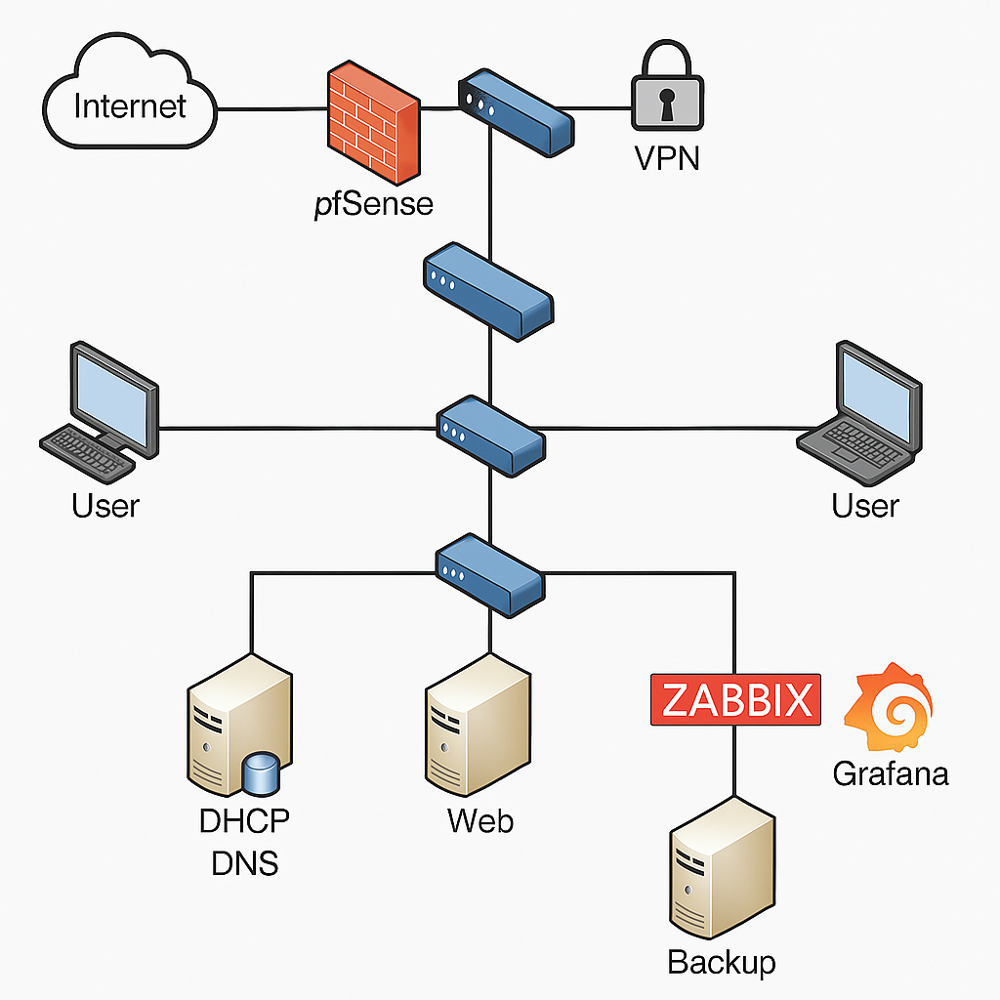

# 🏢 Infraestrutura Completa para Empresas 🚀


## 📌 Visão Geral
> **Uma solução completa para redes empresariais, integrando segurança, automação e monitoramento!**

Este projeto tem como objetivo construir uma **infraestrutura de rede corporativa** altamente eficiente e segura, utilizando tecnologias como **pfSense, Zabbix, Ansible e servidores Linux**. O foco é garantir **alto desempenho, segurança e escalabilidade**.

---

## 🛠️ Tecnologias Utilizadas
✅ **Firewall pfSense + VPN** → Proteção e acesso remoto seguro 🔥  
✅ **Monitoramento com Zabbix e Grafana** → Análise de tráfego em tempo real 📡  
✅ **Automação com Ansible** → Gestão eficiente de redes e servidores 🤖  
✅ **Servidores Linux** → DHCP, DNS, Web e File Server 🌐  
✅ **Switches gerenciáveis** → VLANs e ACLs para segmentação 🏢  
✅ **Backup e Alta Disponibilidade** → Segurança e recuperação 💾  

---

## 📜 Arquitetura da Rede
🔹 **Firewall pfSense** protegendo a rede e gerenciando VPNs.  
🔹 **Servidores Linux** para DHCP, DNS, Web e compartilhamento de arquivos.  
🔹 **Monitoramento com Zabbix** para análise de tráfego e alertas.  
🔹 **Switches gerenciáveis** segmentando a rede com VLANs.  
🔹 **Backup automatizado** para garantir disponibilidade de dados.  

📌 **Topologia do Projeto:**  


---

## 🚀 Configuração Passo a Passo

### 🔥 1️⃣ Configuração do Firewall pfSense
- Instalação do pfSense e configuração das interfaces **WAN/LAN**.
- Criação de regras de firewall para segmentação de tráfego.
- Configuração de **VPN (OpenVPN ou IPSec)** para acesso remoto seguro.

### 🖥️ 2️⃣ Configuração dos Servidores Linux
#### 🔹 Servidor DHCP e DNS
```bash
apt install isc-dhcp-server bind9 -y
nano /etc/dhcp/dhcpd.conf
```

#### 🔹 Servidor Web (Apache)
```bash
apt install apache2 -y
systemctl start apache2
```

### ⚙️ 3️⃣ Automação com Ansible
Criação de **playbooks** para configuração automática de servidores e switches.
```yaml
- name: Configurar VLANs nos switches
  hosts: switches
  tasks:
    - name: Criar VLAN 10
      ios_command:
        commands:
          - vlan 10
          - name REDE_INTERNA
```

### 📡 4️⃣ Monitoramento com Zabbix
- Instalação do **Zabbix Server** e configuração de hosts.
- Integração com **Grafana** para dashboards visuais e alertas.

### 💾 5️⃣ Backup e Alta Disponibilidade
- Backup automatizado usando **rsync e cron jobs**.
```bash
rsync -av /home/user/backup/ /mnt/storage/
```

---

## ✅ Testes e Validações
✔️ Ping entre dispositivos na rede interna.  
✔️ Teste de VPN com conexão remota.  
✔️ Monitoramento de tráfego no Zabbix.  
✔️ Testes de segurança com firewall rules.  
✔️ Automação bem-sucedida com Ansible.

---

## 📜 Conclusão
Este projeto fornece uma solução **robusta e segura** para redes empresariais. O uso de **firewalls, automação e monitoramento** garante alta disponibilidade e segurança.

🔗 **Quer contribuir?** Faça um **fork**, crie um **pull request** ou sugira novas funções! 🚀  
📩 **Dúvidas ou sugestões?** Entre em contato!  
👨‍💻 **Conecte-se comigo:** [LinkedIn](https://www.linkedin.com/in/kaua7k/)
